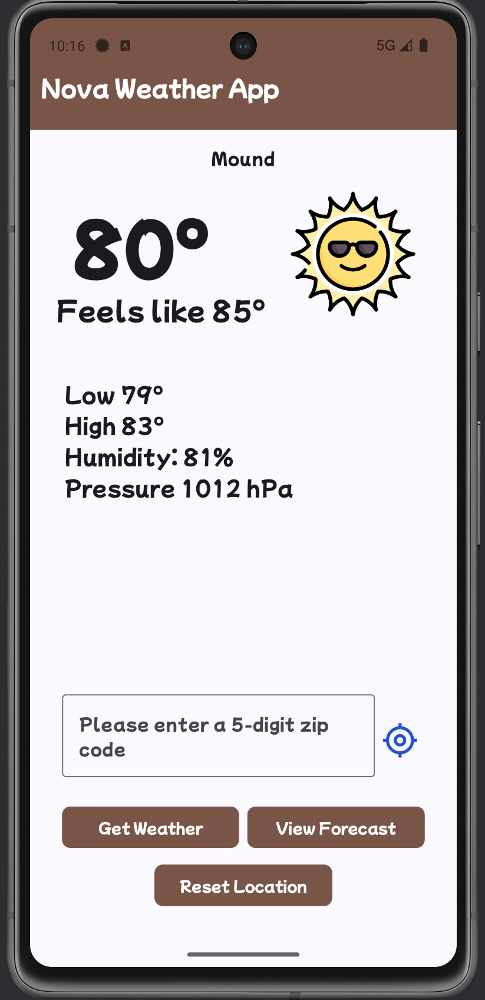
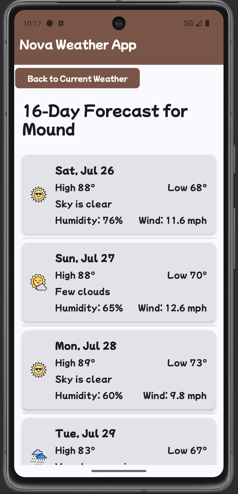

# Nova Weather

An Android weather application built with Kotlin and Jetpack Compose, utilizing a location service and the OpenWeatherMap API to deliver real-time local weather updates and forecasts.

## Table of Contents

*   [About The Project](#about-the-project)
*   [Screenshots](#screenshots)

## About The Project

Nova is designed to provide a clean, modern, and user-friendly experience for checking current weather conditions and forescasts.

It leverages your device's location to provide accurate local weather data and also allows users to search for weather in other locations.

The app is build following modern Android development practices.

## Screenshots

| Current Weather | Forecast Screen |
|---|---|
|  |  |

